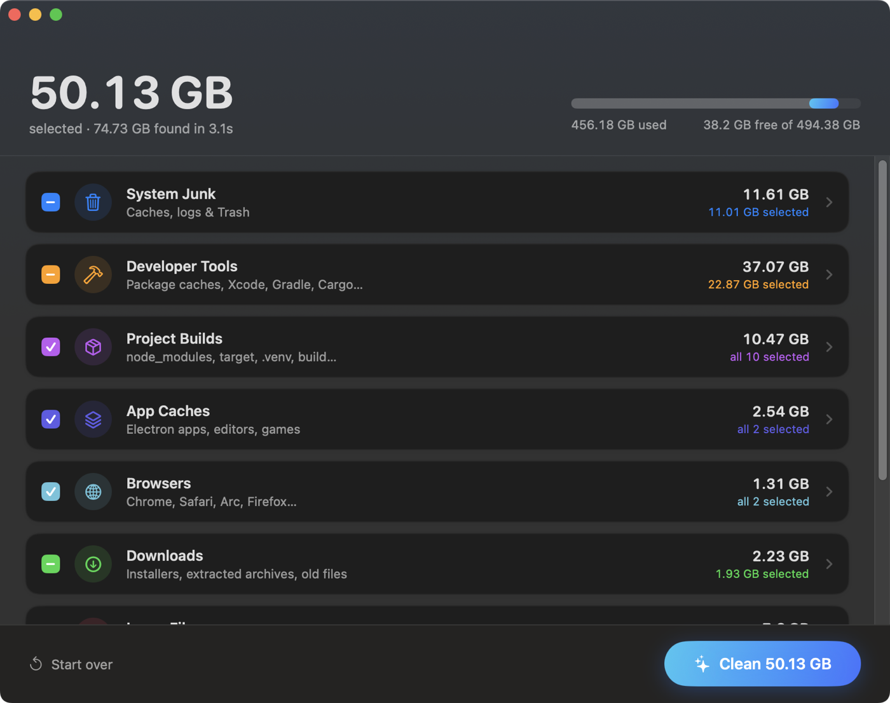
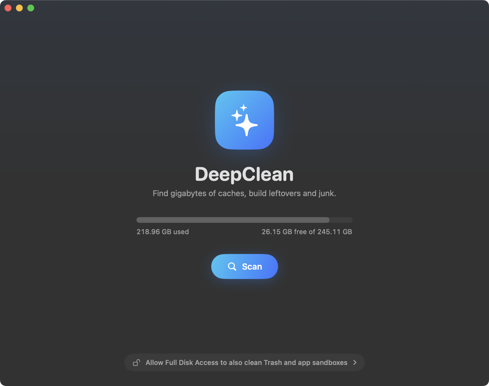

<h1 align="center">
  <br>
  DeepClean
</h1>

<p align="center">
  <b>Blazing-fast Mac cleaner. Reclaim gigabytes in seconds.</b><br>
  A Rust engine with a native SwiftUI app and a CLI.
</p>

<p align="center">
  
  
  
</p>

<p align="center">
  
</p>

## Why DeepClean

Macs quietly fill up with things that rebuild themselves: package caches, `node_modules`,
Rust `target` folders, Gradle and Xcode build data, browser caches, old installers. DeepClean
finds all of it at once and lets you pick what goes.

- **Fast.** Scanning and deleting run in parallel on every core. A full scan of a typical
  home folder takes about 3 seconds.
- **Deep.** Dozens of cache locations, 30+ kinds of project build folders, Downloads clutter,
  large files, byte-identical duplicates and data left behind by uninstalled apps.
- **Careful.** Anything that can't be regenerated (your files, backups, archives) is
  listed but never selected by default, and your own files go to the Trash. See [Safety](#safety).

## Tools

| Tool | What it does |
| --- | --- |
| **Smart Clean** | One scan for caches, developer junk, project builds, Downloads, large files and leftovers |
| **Uninstaller** | Removes an app plus its support files, caches, preferences, sandboxes and launch agents |
| **Space Lens** | Drill into any folder to see what's using space, then move items to the Trash |
| **Optimize** | Flush DNS, reset QuickLook, rebuild Launch Services and Spotlight, free memory, verify the disk |
| **Status** | Live CPU per core, memory and swap, disk, battery health and cycle count, busiest apps |
| **History** | Everything DeepClean has cleaned, by day, with the all-time total |

Free space also shows in the menu bar (with a **Scan Now** shortcut), and **Settings** (⌘,)
holds scan thresholds, the Trash preference and the list of protected folders.

## What it cleans

| Area | Examples |
| --- | --- |
| System junk | `~/Library/Caches`, logs and crash reports, Trash (including external drives), `~/.cache` |
| Browsers | Chrome, Safari, Arc, Brave, Edge, Firefox, Vivaldi, Opera, Chromium |
| App caches | Electron apps (Slack, Discord, VS Code, Notion…), Adobe media cache, Steam, Minecraft |
| Developer tools | npm, Yarn, pnpm, Bun, pip, uv, Poetry, Cargo, Go, Gradle, Maven, CocoaPods, NuGet, Homebrew, Xcode DerivedData and simulators |
| Project builds | `node_modules`, `target`, `.venv`, `build`, `.next`, `.gradle`, `Pods`, `.build`, Unity `Library`, Godot `.godot`, Unreal `Intermediate`… |
| Downloads | Installers (`.dmg`, `.pkg`, `.iso`), archives you already extracted, files untouched for 90+ days |
| Large files | Anything over 200 MB in your home folder, with duplicates flagged |
| App leftovers | Data folders from apps that are no longer installed |
| System | `/Library/Caches`, rotated system logs, Time Machine local snapshots, old macOS installers |

## Install

Requirements: macOS 14+, Apple Silicon, [Rust](https://rustup.rs) and the Xcode Command Line
Tools (`xcode-select --install`). Full Xcode is not needed.

```sh
git clone https://github.com/Greninja9257/DeepClean.git
cd DeepClean
./build-app.sh --install      # builds DeepClean.app and copies it to /Applications
```

Leave off `--install` to build `build/DeepClean.app` without installing it.

> **Tip:** grant DeepClean **Full Disk Access** (System Settings › Privacy & Security) so it
> can also clean Trash, app sandboxes and leftovers. Because the app is signed locally, you may
> need to grant it again after rebuilding.

## Using the app



1. Click **Scan**. Everything is checked at once, usually in a few seconds.
2. Review the groups. Recommended items are pre-selected; click a group to see each item.
3. Click **Clean**. System items ask for your password once.

Right-click any item to **Reveal in Finder** or choose **Never Clean This**. Use the filter box
and the **Select** menu to narrow down big result lists. Switch tools with ⌘1 to ⌘6.

<br clear="right">

## Command line

The same engine works from the terminal.

```sh
cargo install --path .        # installs `deepclean` to ~/.cargo/bin

deepclean                     # interactive menu
deepclean clean               # caches, logs, Trash, browser and dev-tool junk
deepclean purge [PATHS…]      # project build folders (default: your home folder)
deepclean installers          # installers, extracted archives and old files in Downloads
sudo deepclean clean          # also system-wide caches
deepclean uninstall [APP]     # list apps by size, or remove one and its files (to the Trash)
deepclean analyze [PATH]      # what's using space in a folder
deepclean optimize            # maintenance tasks (sudo for the ones that need it)
```

| Flag | Effect |
| --- | --- |
| `-n`, `--dry-run` | Show what would be deleted without touching anything |
| `-y`, `--yes` | Skip the picker and clean the recommended set |
| `--days N` | (`purge`) Skip projects changed in the last N days (default 7) |
| `--containers` | (`clean`) Also scan sandboxed app containers |
| `--no-log` | Don't write the operations log |

In the picker, <kbd>space</kbd> toggles an item, <kbd>a</kbd> toggles all, <kbd>enter</kbd>
confirms and <kbd>esc</kbd> cancels.

## Safety

Caches and build folders are deleted permanently, since they rebuild themselves. Your own
files (downloads, large files, app leftovers and uninstalled apps) go to the Trash instead,
so you can put them back. You can change that in Settings.

- **Safety gate.** Every path is checked right before deletion. It must sit inside your home
  folder or a known cache or log location, and can never be a top-level folder like `~/Documents`
  or anything inside `~/.ssh`, Keychains or iCloud Drive. Symlinks are removed, never followed.
- **Project folders only match real projects.** `target` needs a `Cargo.toml` or `pom.xml`
  next to it, `.venv` must contain `pyvenv.cfg`, and so on.
- **Active and tracked work is skipped.** Projects changed in the last 7 days, anything tracked
  by git, and folders holding keys or certificates (`.pem`, `.p12`, keystores) are left alone.
- **Opt-in for anything personal.** Large files, old downloads, AI models, iOS backups, Xcode
  Archives and system items are never selected by default.
- **Running apps are respected.** Caches for apps that are open (Chrome, Xcode…) are deselected.
- **Uninstalls stay in bounds.** Only third-party apps can be removed (never Apple's), and
  system-level helpers are matched by the app's bundle ID inside a short list of folders.
- **Whitelist.** `deepclean whitelist add <path>` protects a path forever (`list` and `remove`
  also work). In the app, use **Never Clean This** or Settings › Protected.
- **Log.** Every operation is recorded in `~/Library/Logs/deepclean/operations.log`. View it
  with `deepclean history`.

When in doubt, run `deepclean clean --dry-run` first.

## How it works

```
DeepClean.app (SwiftUI)  ──JSON over stdout──▶  deepclean-engine (Rust)
                                                 ├─ catalog   cache locations
                                                 ├─ purge     project build folders
                                                 ├─ extra     downloads, large files, leftovers
                                                 ├─ apps      uninstaller
                                                 ├─ analyze   Space Lens
                                                 ├─ scan      runs every scanner in parallel
                                                 └─ clean     safety gate, parallel delete, Trash
```

The app bundles the Rust binary and talks to it over line-delimited JSON (`scan-json`,
`clean-json`, `apps-json`, `analyze-json`, …). Settings live in
`~/.config/deepclean/settings.json` and are shared by the app and the CLI. Admin-only items run through the same engine via the standard macOS password
prompt. External tools are only ever invoked from a fixed allowlist (`brew cleanup`,
`xcrun simctl`, `tmutil`, …).

## Credits

Inspired by [Mole](https://github.com/tw93/Mole).
